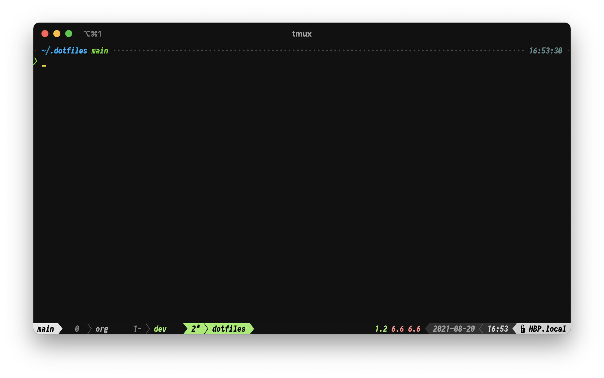

# Config & Dotfiles

An extendable dotfiles config for mac and ubuntu.

These dotfiles are setup to make setting up and maintaining a personal system as effortless as possible.

---

## Software

- Editor: [Doom Emacs](https://starship.rs/) & [VSCode](https://code.visualstudio.com/)
- Shell: [ZSH](https://zsh.sourceforge.io/)
- Prompt: [Stasrship](https://starship.rs/)
- Multiplexer: [Tmux](http://tmuxcheatsheet.com/)